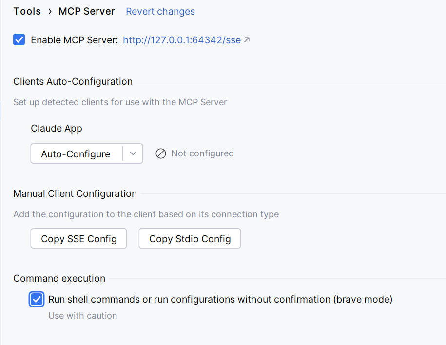

```shell
claude mcp add --transport sse pycharm "http://localhost:64342/sse" --scope user      

```

it add ito to ~\.claude.json outside any projects in the json root
```json
"mcpServers": {
    "pycharm": {
      "type": "sse",
      "url": "http://localhost:64342/sse"
    }
  }
```

now mcp list shows it

pycharm: http://localhost:64342/sse (SSE) - ✓ Connected

