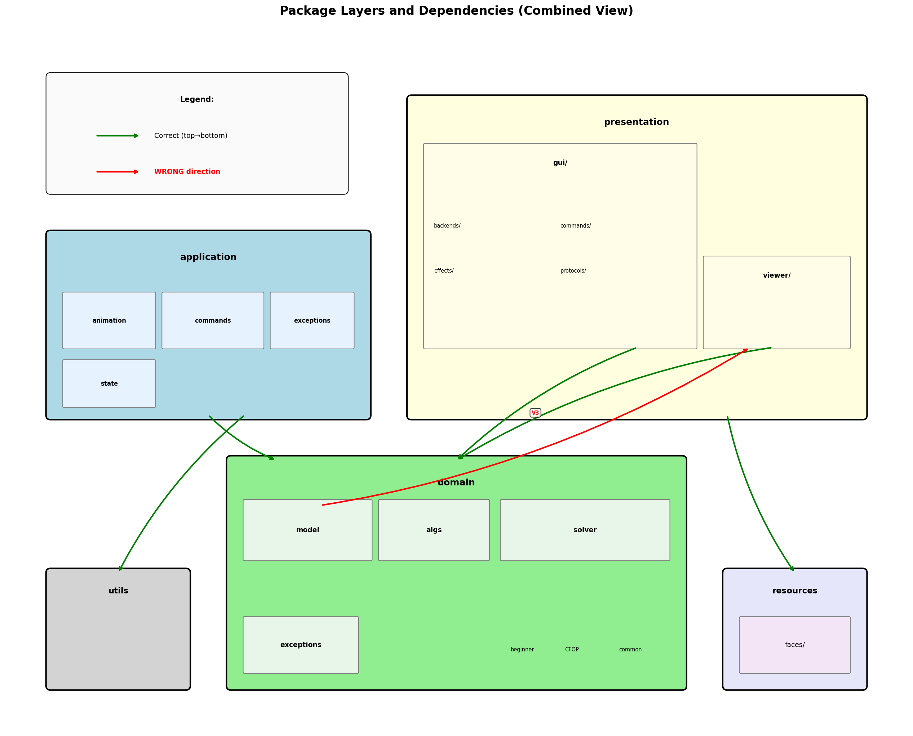

# Package Layers and Dependencies

This document describes the package structure of `src/cube/` and the dependencies between packages.

---

## Complete Overview



---

## First Level Packages (bottom-to-top order)

| Layer | Package | Purpose |
|-------|---------|---------|
| Foundation | `utils/` | Utility functions (OrderedSet, etc.) |
| Foundation | `resources/` | Static resources (face images) |
| Bottom | `domain/` | Core business logic (cube model, solvers, algorithms) |
| Middle | `application/` | Application logic, state management, commands |
| Top | `presentation/` | GUI, viewers, rendering backends |

**Ideal dependency flow:** `presentation -> application -> domain -> utils/resources`

---

## Second Level Packages

### application/
| Package | Purpose |
|---------|---------|
| `animation/` | Animation management and timing |
| `commands/` | Operator/command system for cube operations |
| `exceptions/` | Custom exception types |
| `config` | Application configuration |

### domain/
| Package | Purpose |
|---------|---------|
| `algs/` | Algorithm definitions (Alg, SimpleAlg, SliceAbleAlg) |
| `model/` | Cube model classes (Cube, Part, Face, Edge, Corner, etc.) |
| `solver/` | Solving algorithms |
| `solver/beginner/` | Layer-by-layer beginner method |
| `solver/CFOP/` | CFOP speedcubing method |
| `solver/common/` | Shared solver utilities (Tracker, CommonOp) |
| `solver/protocols/` | Protocol interfaces for dependency inversion |
| `exceptions/` | Domain-specific exceptions |

### presentation/
| Package | Purpose |
|---------|---------|
| `gui/` | GUI framework and window management |
| `gui/backends/` | Backend implementations (pyglet2, tkinter, console, headless, web) |
| `gui/commands/` | GUI command pattern implementations |
| `gui/effects/` | Visual effects (confetti, sparkle) |
| `gui/protocols/` | Protocol definitions for GUI abstraction |
| `viewer/` | Cube viewer logic (_cell, _Board, etc.) |

---

## Dependencies

### Normal Dependencies (green arrows)
- `application` -> `domain` (uses cube model and algorithms)
- `presentation` -> `domain` (displays cube state)
- `presentation` -> `application` (uses operators and animation)
- `domain` -> `utils` (OrderedSet usage)
- `presentation` -> `resources` (face images)

---

## Wrong Direction Dependencies (red arrows)

| ID  | From      | To             | Status  | Issue |
|-----|-----------|----------------|---------|-------|
| V1  | `domain`  | `application`  | FIXED | Domain imported exceptions from application |
| V2  | `domain`  | `application`  | FIXED | Domain imported commands/operators from application |
| V3  | `domain`  | `presentation` | FIXED | Domain imported VMarker from presentation |
| V4  | `domain`  | `application`  | FIXED | Domain imported config from application |
| V5  | `application` | `presentation` | OPEN | Application imports protocols from presentation (4 files) |

---

## Fixes Applied

### V1: Exceptions (FIXED)
- Created `domain/exceptions/` with InternalSWError, OpAborted, etc.
- Application re-exports for backward compatibility

### V2: Commands/Protocols (FIXED)
- Created `domain/solver/protocols/` with OperatorProtocol, AnnotationProtocol
- Moved AnnWhat enum to `domain/solver/AnnWhat.py`
- Domain imports protocols instead of concrete application classes

### V3: Viewer/VMarker (FIXED)
- Moved `VMarker.py` to `domain/model/VMarker.py`
- Presentation re-exports for backward compatibility

### V4: Config Protocol (FIXED)
- Created `utils/config_protocol.py` with `ConfigProtocol` interface
- Created `application/config_impl.py` implementing the protocol by wrapping config.py
- Domain imports `get_config()` from utils instead of config from application
- Protocol initialized at app startup via `init_config()`

---

## Remaining Violations

### V5: Protocols (OPEN)
Application imports from presentation (4 files):
- `application/animation/AnimationManager.py` -> `presentation.gui.protocols`
- `application/commands/OpAnnotation.py` -> `presentation.viewer.VMarker`
- `application/state.py` -> `presentation.gui.protocols.Renderer`

**Potential fix:** Move protocols to `application/` or use dependency injection

---

## Ideal Architecture (Clean Architecture)

```
presentation -> application -> domain -> utils/resources
```

Currently 1 violation remains (V5) preventing clean architecture.

---

## Source Files

- Generator script: `design2/images/generate_layers_diagrams.py`

To regenerate diagram:
```bash
cd design2/images
python generate_layers_diagrams.py
```

---

*Last updated: 2025-12-07*
