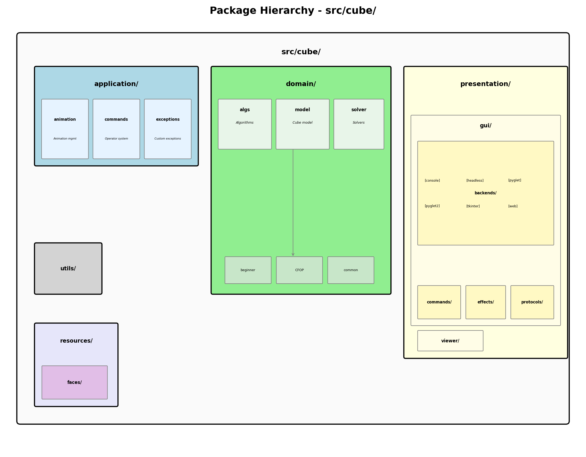
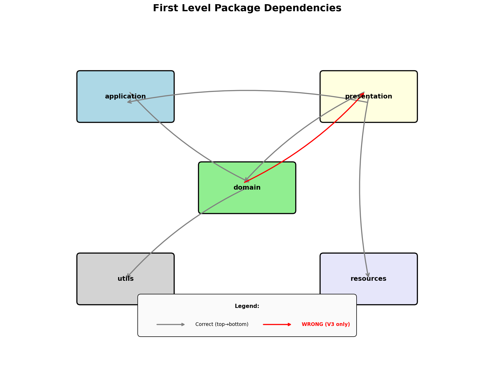
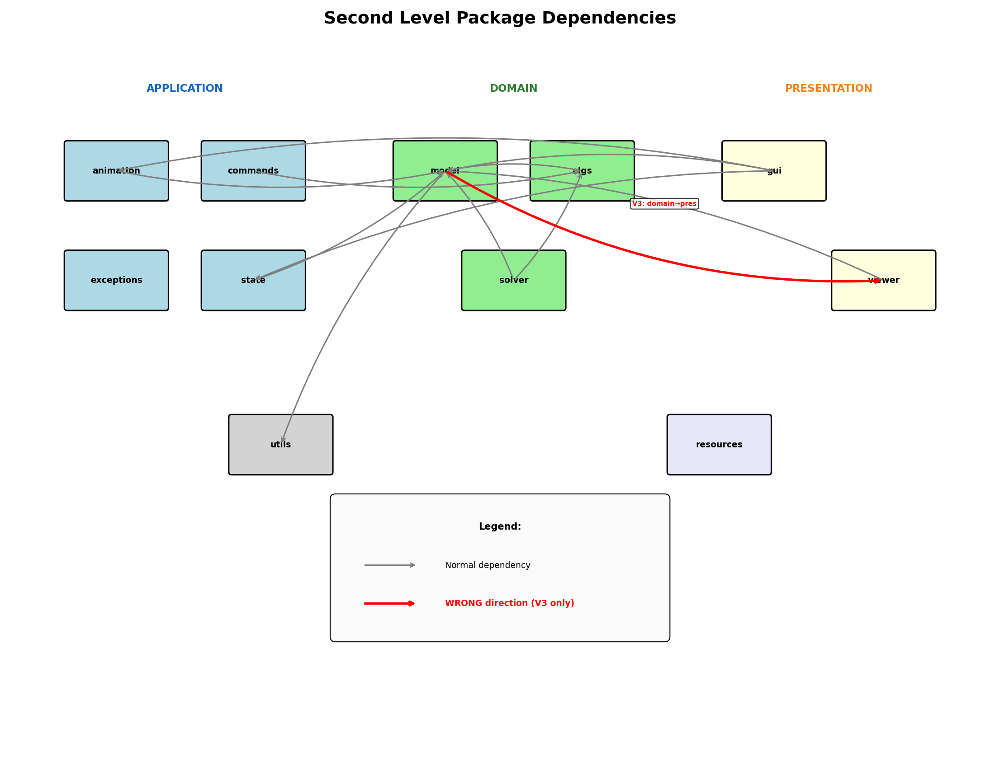

# Package Layers and Dependencies

This document describes the package structure of `src/cube/` and the dependencies between packages.

---

## Package Hierarchy



### First Level Packages (bottom-to-top order)

| Layer | Package | Purpose |
|-------|---------|---------|
| Foundation | `utils/` | Utility functions (OrderedSet, etc.) |
| Foundation | `resources/` | Static resources (face images) |
| Bottom | `domain/` | Core business logic (cube model, solvers, algorithms) |
| Middle | `application/` | Application logic, state management, commands |
| Top | `presentation/` | GUI, viewers, rendering backends |

**Ideal dependency flow:** `presentation → application → domain → utils/resources`

### Second Level Packages

#### application/
| Package | Purpose |
|---------|---------|
| `animation/` | Animation management and timing |
| `commands/` | Operator/command system for cube operations |
| `exceptions/` | Custom exception types |

#### domain/
| Package | Purpose |
|---------|---------|
| `algs/` | Algorithm definitions (Alg, SimpleAlg, SliceAbleAlg) |
| `model/` | Cube model classes (Cube, Part, Face, Edge, Corner, etc.) |
| `solver/` | Solving algorithms |
| `solver/beginner/` | Layer-by-layer beginner method |
| `solver/CFOP/` | CFOP speedcubing method |
| `solver/common/` | Shared solver utilities (Tracker, CommonOp) |

#### presentation/
| Package | Purpose |
|---------|---------|
| `gui/` | GUI framework and window management |
| `gui/backends/` | Backend implementations (pyglet2, tkinter, console, headless, web) |
| `gui/commands/` | GUI command pattern implementations |
| `gui/effects/` | Visual effects (confetti, sparkle) |
| `gui/protocols/` | Protocol definitions for GUI abstraction |
| `viewer/` | Cube viewer logic (_cell, _Board, etc.) |

---

## First Level Dependencies



### Normal Dependencies (one-way)
- `domain` → `utils` (OrderedSet usage)
- `presentation` → `resources` (face images)

### Wrong Direction Dependencies (architectural issues)

**These are highlighted in RED in the diagram:**

| ID  | From      | To             | Status  | Issue                                       |
|-----|-----------|----------------|---------|---------------------------------------------|
| V1  | `domain`  | `application`  | ✅ FIXED | Domain imported from `application.exceptions` |
| V2  | `domain`  | `application`  | ❌ Open  | Domain imports from `application.commands` (16 files) |
| V3  | `domain`  | `presentation` | ❌ Open  | Domain imports from `presentation.viewer` (2 files) |

---

## Second Level Dependencies



### Normal Flow (gray arrows)
- `solver` → `model`, `algs` (solvers use model and algorithms)
- `gui` → `model`, `algs`, `state`, `animation` (presentation uses domain and app services)
- `viewer` → `model` (viewer displays cube model)

### Wrong Direction Dependencies (RED - architectural issues)

| ID  | From             | To                       | Status   | Description                                    |
|-----|------------------|--------------------------|----------|------------------------------------------------|
| V1  | `domain.solver`  | `application.exceptions` | ✅ FIXED  | Moved exceptions to `domain.exceptions`        |
| V2  | `domain.solver`  | `application.commands`   | ❌ Open   | Solver uses Operator and annotation (16 files) |
| V3  | `domain.model`   | `presentation.viewer`    | ❌ Open   | Model has visualization hooks (2 files)        |

---

## Dependency Rules

### Ideal Architecture (Clean Architecture)
```
presentation → application → domain → (nothing external)
                  ↓
               utils/resources
```

### Current Issues
1. **V2: Domain depends on Application (commands)** - Solver imports Operator from application.commands (16 files)
2. **V3: Domain depends on Presentation** - Model imports viewer utilities (2 files)

### Fixes Applied
1. ✅ **V1: Exceptions** - Moved to `domain.exceptions`, application re-exports for backward compatibility

### Potential Fixes (remaining)
1. **V2:** Move Operator to domain or use dependency injection for command annotations
2. **V3:** Use dependency injection for visualization hooks
3. Extract interfaces to break circular dependencies

---

## Source Files

The diagrams are generated from:
- Generator script: `design2/images/generate_layers_diagrams.py`
- PlantUML sources: `design2/.state/image-sources/*.puml`

To regenerate diagrams:
```bash
cd design2/images
python generate_layers_diagrams.py
```

---

*Last updated: 2025-12-07*
