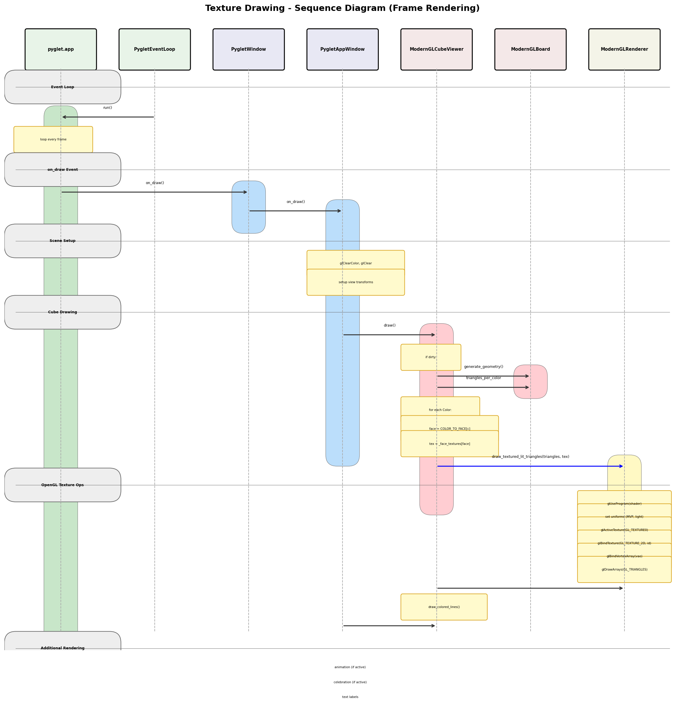

# Texture Drawing Flow

This document explains the complete flow from the event loop to texture rendering on screen.
It is intended to support investigation of texture-related bugs.

**Related Files:**
- `src/cube/presentation/gui/backends/pyglet2/ModernGLRenderer.py` - Texture loading/binding, shader drawing
- `src/cube/presentation/gui/backends/pyglet2/ModernGLCubeViewer.py` - Texture mode, face textures
- `src/cube/presentation/gui/backends/pyglet2/_modern_gl_board.py` - Geometry generation for 6 faces
- `src/cube/presentation/gui/backends/pyglet2/_modern_gl_face.py` - Cell mapping to domain model
- `src/cube/presentation/gui/backends/pyglet2/_modern_gl_cell.py` - UV coordinate generation
- `src/cube/presentation/gui/backends/pyglet2/_modern_gl_constants.py` - COLOR_TO_HOME_FACE mapping
- `src/cube/presentation/gui/backends/pyglet2/PygletAppWindow.py` - Texture set loading
- `src/cube/presentation/gui/backends/pyglet2/PygletEventLoop.py` - Frame trigger

---

## Overview

The texture drawing system uses a layered architecture:

1. **Event Loop Layer** - Triggers frame updates via pyglet
2. **Window Layer** - Receives `on_draw()` callbacks
3. **Viewer Layer** - Manages cube geometry and texture state
4. **Renderer Layer** - Handles OpenGL texture operations and shader-based drawing


---

## Class Diagram

See: `design2/.state/image-sources/texture-drawing-classes.puml`


### Key Classes

| Class | Responsibility |
|-------|----------------|
| `PygletEventLoop` | Runs pyglet.app event loop, triggers frame updates |
| `PygletWindow` | Pyglet window wrapper, receives `on_draw()` events |
| `PygletAppWindow` | Application window, orchestrates drawing sequence |
| `ModernGLCubeViewer` | Manages cube geometry, texture mode, face textures |
| `ModernGLRenderer` | OpenGL operations: texture loading, binding, shader drawing |
| `ModernGLBoard` | Generates geometry with UV coordinates for 6 faces |

---

## Sequence Diagram: Frame Rendering

See: `design2/.state/image-sources/texture-drawing-sequence.puml`



### Step-by-Step Flow

1. **Event Loop Tick**
   - `PygletEventLoop.run()` calls `pyglet.app.run()`
   - Pyglet's internal loop processes clock ticks

2. **on_draw Event**
   - Pyglet dispatches `on_draw` event to `PygletWindow`
   - `PygletWindow.on_draw()` delegates to `PygletAppWindow.on_draw()`

3. **Scene Setup**
   - Clear screen with `glClearColor()`
   - Set up view transforms (camera, rotations)

4. **Cube Drawing**
   - `ModernGLCubeViewer.draw()` is called
   - If geometry is dirty, rebuild via `ModernGLBoard.generate_geometry()`
   - Check `_texture_mode` flag

5. **Textured Rendering Path**
   - For each color in `_triangles_per_color`:
     - Map color to home face (e.g., WHITE -> U face)
     - Get texture handle from `_face_textures[face]`
     - Call `renderer.draw_textured_lit_triangles(triangles, texture_handle)`

6. **OpenGL Texture Operations**
   - Activate texture unit: `glActiveTexture(GL_TEXTURE0)`
   - Bind texture: `glBindTexture(GL_TEXTURE_2D, gl_texture_id)`
   - Use textured Phong shader
   - Draw triangles with position, normal, color, and UV data

---

## Texture Loading Flow

See: `design2/.state/image-sources/texture-loading-sequence.puml`


### Sequence: Loading a Texture Set

```
PygletAppWindow._load_current_texture_set()
    |
    +-- Get path from TEXTURE_SETS[index]
    |
    +-- IF path is None:
    |       ModernGLCubeViewer.set_texture_mode(False)
    |
    +-- ELSE:
            ModernGLCubeViewer.load_texture_set(directory)
                |
                +-- FOR each face (F, B, R, L, U, D):
                |       TRY find {face}.{png,jpg,jpeg,bmp}
                |       load_face_texture(face, path)
                |           |
                |           +-- renderer.load_texture(path)
                |           |       pyglet.image.load()
                |           |       glGenTextures()
                |           |       glTexImage2D()
                |           |       glGenerateMipmap()
                |           |       RETURN handle
                |           |
                |           +-- _face_textures[face] = handle
                |           +-- _dirty = True
                |
                +-- set_texture_mode(True)
```

---

## Texture Data Structures

### TextureHandle

```python
TextureHandle = int  # Opaque handle, NOT the GL texture ID
```

The renderer maintains an internal mapping:
```python
_textures: dict[int, ctypes.c_uint]  # handle -> GL texture ID
_next_texture_handle: int = 1
```

### Face Texture Mapping

```python
# In ModernGLCubeViewer
_face_textures: dict[FaceName, TextureHandle]
# Example: {FaceName.F: 1, FaceName.B: 2, ...}

# Color to face mapping (for texture selection)
COLOR_TO_HOME_FACE: dict[Color, FaceName]
# Example: {Color.WHITE: FaceName.U, Color.YELLOW: FaceName.D, ...}
```

### Vertex Data Layout (Textured)

Each vertex has 11 floats:
```
Position (3) | Normal (3) | Color (3) | TexCoord (2)
   x,y,z     |  nx,ny,nz  |  r,g,b    |    u,v
```

---

## Shader Pipeline

### Textured Phong Vertex Shader

```glsl
// Inputs
in vec3 position;   // location 0
in vec3 normal;     // location 1
in vec3 color;      // location 2
in vec2 texCoord;   // location 3

// Outputs to fragment shader
out vec3 vColor;
out vec3 vNormal;
out vec3 vFragPos;
out vec2 vTexCoord;
```

### Textured Phong Fragment Shader

```glsl
uniform sampler2D uTexture;
uniform int uUseTexture;

void main() {
    vec3 baseColor;
    if (uUseTexture == 1) {
        baseColor = texture(uTexture, vTexCoord).rgb;
    } else {
        baseColor = vColor;
    }
    // Apply Phong lighting...
    FragColor = vec4(result, 1.0);
}
```

---

## State Flags

| Flag | Location | Purpose |
|------|----------|---------|
| `_texture_mode` | ModernGLCubeViewer | Enable/disable texture rendering |
| `_dirty` | ModernGLCubeViewer | Mark geometry needs rebuild |
| `_bound_texture` | ModernGLRenderer | Track currently bound texture |

---

## PartEdge to Texture Mapping

This section explains how domain model stickers (PartEdge) map to textured geometry.

### Flow: PartEdge → Textured Cell

```
PartEdge (domain model - sticker with color)
    ↓
ModernGLFace._get_cell_part_slice(row, col)
    ↓
ModernGLFace._get_cell_color() → Color enum (e.g., WHITE)
    ↓
ModernGLCell (presentation - quad with UV coords)
    ↓
generate_textured_vertices() → 6 vertices with UV
    ↓
Group by Color → COLOR_TO_HOME_FACE → Texture handle
    ↓
draw_textured_lit_triangles() → OpenGL renders
```

### Key Insight: Textures Follow Colors, Not Face Positions

The critical design is that **textures are bound per COLOR, not per face position**:

```python
# In ModernGLCubeViewer.draw():
for color, triangles in self._triangles_per_color.items():
    home_face = COLOR_TO_HOME_FACE[color]  # WHITE → U, RED → R, etc.
    texture = self._face_textures[home_face]
    renderer.draw_textured_lit_triangles(triangles, texture)
```

This means when a WHITE sticker moves from the Up face to the Front face,
it still uses the U.png texture - the texture "follows" the color!

### Color to Home Face Mapping

```python
# _modern_gl_constants.py
COLOR_TO_HOME_FACE: dict[Color, FaceName] = {
    Color.GREEN:  FaceName.F,   # Green = Front
    Color.BLUE:   FaceName.B,   # Blue = Back
    Color.RED:    FaceName.R,   # Red = Right
    Color.ORANGE: FaceName.L,   # Orange = Left
    Color.WHITE:  FaceName.U,   # White = Up
    Color.YELLOW: FaceName.D,   # Yellow = Down
}
```

### Domain → Presentation Cell Mapping

The `_get_cell_part_slice()` method maps (row, col) grid positions to domain model parts:

```python
# _modern_gl_face.py
def _get_cell_part_slice(self, face, row, col) -> PartSlice | None:
    size = face.cube.size
    last = size - 1

    # Grid layout (3x3 example):
    #   row 2: [corner_TL]  [edge_T]    [corner_TR]
    #   row 1: [edge_L]     [center]    [edge_R]
    #   row 0: [corner_BL]  [edge_B]    [corner_BR]
    #          col 0        col 1       col 2

    # Corners (4 corners of face)
    if row == 0 and col == 0:
        return face.corner_bottom_left.slice
    if row == 0 and col == last:
        return face.corner_bottom_right.slice
    if row == last and col == 0:
        return face.corner_top_left.slice
    if row == last and col == last:
        return face.corner_top_right.slice

    # Edges (border cells, excluding corners)
    if row == 0 and 0 < col < last:
        return face.edge_bottom.get_slice_by_ltr_index(face, col - 1)
    if row == last and 0 < col < last:
        return face.edge_top.get_slice_by_ltr_index(face, col - 1)
    if col == 0 and 0 < row < last:
        return face.edge_left.get_slice_by_ltr_index(face, row - 1)
    if col == last and 0 < row < last:
        return face.edge_right.get_slice_by_ltr_index(face, row - 1)

    # Centers (interior cells)
    if 0 < row < last and 0 < col < last:
        return face.center.get_slice((row - 1, col - 1))

    return None
```

### UV Coordinate Calculation

Each cell gets a portion of the face texture based on its (row, col) position:

```python
# In ModernGLCell.generate_textured_vertices():
u0 = col / size        # Left edge in texture space [0.0-1.0]
v0 = row / size        # Bottom edge in texture space
u1 = (col + 1) / size  # Right edge
v1 = (row + 1) / size  # Top edge
```

**UV mapping visualization for a 3x3 cube:**

```
Texture Space (0,0) at bottom-left, (1,1) at top-right:

    v=1.0  +-------+-------+-------+
           | (0,2) | (1,2) | (2,2) |  ← row 2 (top)
    v=0.67 +-------+-------+-------+
           | (0,1) | (1,1) | (2,1) |  ← row 1 (middle)
    v=0.33 +-------+-------+-------+
           | (0,0) | (1,0) | (2,0) |  ← row 0 (bottom)
    v=0.0  +-------+-------+-------+
           u=0   u=0.33  u=0.67  u=1.0
           col 0   col 1   col 2
```

**Example: Center cell (row=1, col=1) UV rect:**
- u0 = 1/3 = 0.333, v0 = 1/3 = 0.333
- u1 = 2/3 = 0.667, v1 = 2/3 = 0.667

### Vertex Generation

Each cell generates 2 triangles (6 vertices), with 11 floats per vertex:

```python
# ModernGLCell.generate_textured_vertices()
def generate_textured_vertices(self, dest: list[float], size: int) -> None:
    lb, rb, rt, lt = self._corners  # 3D corner positions
    nx, ny, nz = self._normal       # Face normal
    r, g, b = self._color           # RGB fallback color

    # UV for this cell
    u0, v0 = self.col / size, self.row / size
    u1, v1 = (self.col + 1) / size, (self.row + 1) / size

    # Triangle 1: bottom-left, bottom-right, top-right
    dest.extend([lb[0], lb[1], lb[2], nx, ny, nz, r, g, b, u0, v0])
    dest.extend([rb[0], rb[1], rb[2], nx, ny, nz, r, g, b, u1, v0])
    dest.extend([rt[0], rt[1], rt[2], nx, ny, nz, r, g, b, u1, v1])

    # Triangle 2: bottom-left, top-right, top-left
    dest.extend([lb[0], lb[1], lb[2], nx, ny, nz, r, g, b, u0, v0])
    dest.extend([rt[0], rt[1], rt[2], nx, ny, nz, r, g, b, u1, v1])
    dest.extend([lt[0], lt[1], lt[2], nx, ny, nz, r, g, b, u0, v1])
```

### Animation Support

Animated parts (during face rotation) are separated from static geometry:

```python
# ModernGLBoard.generate_textured_geometry()
def generate_textured_geometry(self, animated_parts):
    static_verts: dict[Color, list[float]] = {c: [] for c in Color}
    animated_verts: dict[Color, list[float]] = {c: [] for c in Color}

    for cell in face.cells:
        is_animated = (
            animated_parts is not None and
            cell.part_slice is not None and
            cell.part_slice in animated_parts
        )

        target = animated_verts if is_animated else static_verts
        cell.generate_textured_vertices(target[color], size)
```

Animated vertices are drawn with a rotation matrix applied, allowing smooth face rotations.

---

## Potential Bug Investigation Points

When investigating texture bugs, check:

1. **Texture Loading**
   - Is `load_texture()` returning a valid handle?
   - Are PNG files being found in the texture set directory?
   - Check `_textures` dict for handle->GL ID mapping

2. **Texture Binding**
   - Is `bind_texture()` being called before drawing?
   - Is the correct texture handle being used for each face/color?
   - Check `glGetError()` after binding

3. **UV Coordinates**
   - Are UV coords being generated correctly in `ModernGLBoard`?
   - Check vertex data layout (11 floats per vertex)

4. **Shader Uniforms**
   - Is `uUseTexture` set to 1?
   - Is `uTexture` bound to texture unit 0?

5. **Draw Order**
   - Is texture bound BEFORE `glDrawArrays()`?
   - Is texture unbound after drawing (to avoid state leaks)?

---

## Related Documentation

- [Model Architecture Overview](model-architecture-overview.md)
- [Layers and Dependencies](layers-and-dependencies.md)
- [PartEdge Attribute System](partedge-attribute-system.md)
