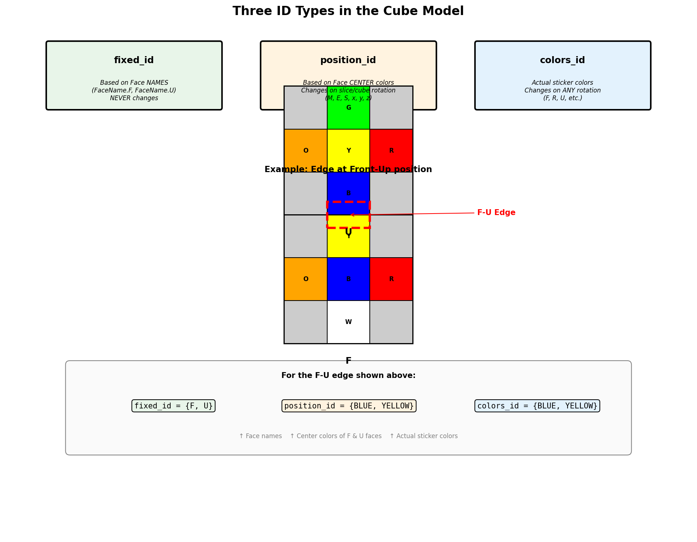
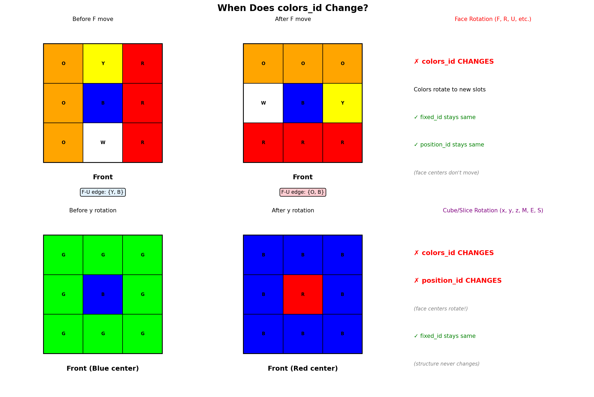
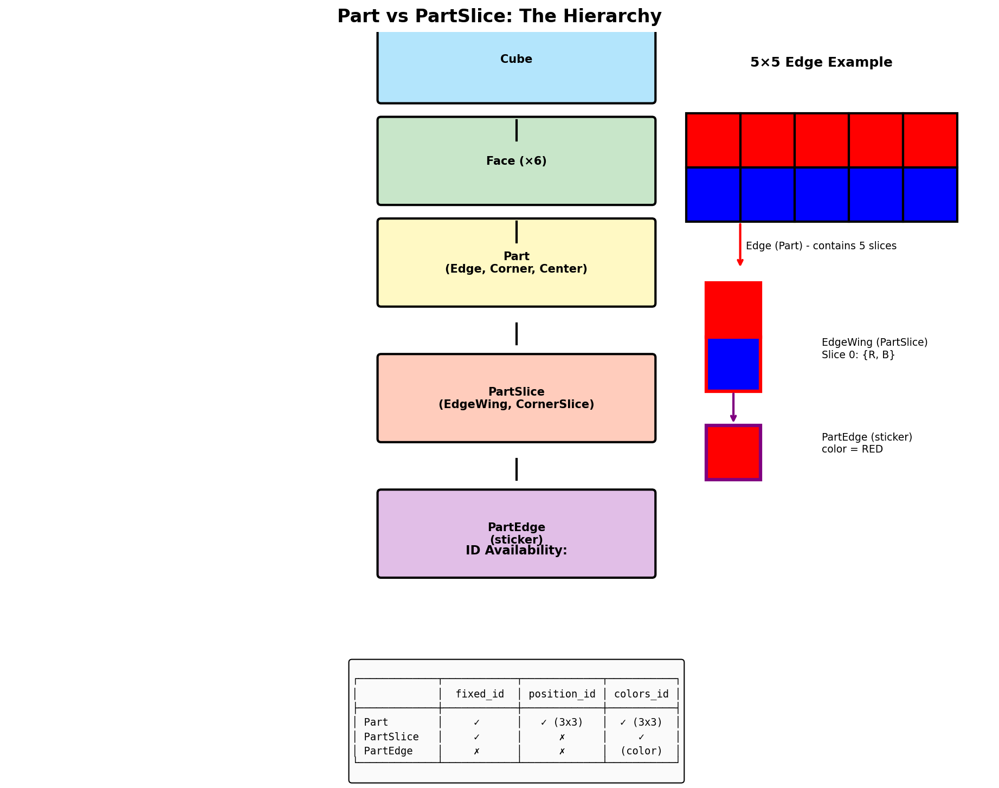

# Model ID System - Visual Documentation

This document provides visual diagrams explaining the three ID types in the cube model.

**Key Source Files:**
- [`cube_boy.py`](../../src/cube/domain/model/cube_layout/cube_boy.py) - Cube creation with BOY color scheme
- [`Part.py`](../../src/cube/domain/model/Part.py) - Part class with all ID properties
- [`_part_slice.py`](../src/cube/domain/model/_part_slice.py) - PartSlice with slice-level IDs
- [`Edge.py`](../src/cube/domain/model/Edge.py) - Edge class with is3x3 property

---

## Overview: Three Types of IDs



*The three ID types serve different purposes: fixed_id identifies the structural slot, position_id identifies where a part should go, and colors_id identifies what piece it actually is.*

| ID Type | Based On | Changes When | Code Location |
|---------|----------|--------------|---------------|
| `fixed_id` | Face NAMES (FaceName enum) | NEVER | [`Part.py:99`](../src/cube/domain/model/Part.py) |
| `position_id` | Face CENTER colors | Slice/cube rotation (M,E,S,x,y,z) | [`Part.py:272`](../src/cube/domain/model/Part.py) |
| `colors_id` | Actual sticker colors | ANY rotation | [`Part.py:319`](../src/cube/domain/model/Part.py) |

---

## Core Concept: Parts are FIXED, Only Colors Move!


*This is fundamental: the physical slots (Parts) never move in 3D space. Only the colored stickers rotate through the slots during cube moves.*

### Why This Matters

```python
# From Part.py - fixed_id is based on face NAMES, not colors
@property
def fixed_id(self) -> PartFixedID:
    """
    Based on face NAMES - never changes regardless of cube state.
    Identifies the physical SLOT in the cube structure.
    """
    return frozenset(edge.face.name for edge in self._edges)
```

**Reference:** [`Part.py:99-113`](../src/cube/domain/model/Part.py)

---

## 1. fixed_id - Structural Identity

**Definition:** Based on face NAMES (enum values), never changes.

**Purpose:** Identifies the physical SLOT in the cube structure.

```
    Edge at Front-Up position:

    fixed_id = frozenset({FaceName.F, FaceName.U})
                         ▲           ▲
                         │           │
                    Face NAME   Face NAME
                    (not color!)

    This NEVER changes, even if you rotate the whole cube!
```

**Code Reference:** [`Part.fixed_id`](../src/cube/domain/model/Part.py) at line ~99

---

## 2. position_id - Target Position by Face Colors

**Definition:** Colors of the FACES the part is currently ON.

**Purpose:** Tells you where a part SHOULD go (based on face center colors).

```python
# From Part.py
@property
def position_id(self) -> PartColorsID:
    """
    Based on face CENTER colors - changes on slice/cube rotation.
    Tells you the TARGET position for this slot.
    """
    return frozenset(edge.face.color for edge in self._3x3_representative_edges)
```

**Code Reference:** [`Part.position_id`](../src/cube/domain/model/Part.py) at line ~272

---

## 3. colors_id - Actual Part Colors

**Definition:** The ACTUAL colors currently visible on the part.

**Purpose:** Identifies WHICH piece this is (by its sticker colors).

```python
# From Part.py
@property
def colors_id(self) -> PartColorsID:
    """
    Actual sticker colors - changes on ANY rotation.
    Identifies the specific piece by its colors.
    """
    return frozenset(edge.color for edge in self._3x3_representative_edges)
```

**Code Reference:** [`Part.colors_id`](../src/cube/domain/model/Part.py) at line ~319

---

## When Does colors_id Change?



*Critical distinction: Face rotations (F, R, U, etc.) only change colors_id. Cube/slice rotations (x, y, z, M, E, S) change BOTH colors_id AND position_id!*

### Summary Table

| Rotation Type | fixed_id | position_id | colors_id |
|--------------|----------|-------------|-----------|
| Face (F, R, U, L, B, D) | ✓ Same | ✓ Same | ✗ Changes |
| Cube (x, y, z) | ✓ Same | ✗ Changes | ✗ Changes |
| Slice (M, E, S) | ✓ Same | ✗ Changes | ✗ Changes |

**Code Reference:** See [`Face.py:211-267`](../src/cube/domain/model/Face.py) for rotation logic

---

## Evolution: Big Cube → 3x3 Reduction


*The two-phase solving approach: Phase 1 works with individual slices, Phase 2 works with whole parts after reduction.*

### Phase 1: Big Cube (is3x3 = FALSE)

```python
# From NxNEdges.py - works with SLICES
for i in range(n_slices):
    a_slice = edge.get_slice(i)
    a_slice_id = a_slice.colors_id  # ← Slice-level colors_id
    if a_slice_id != target_color:
        # fix this slice
```

**Code Reference:** [`solver/NxNEdges.py`](../src/cube/domain/solver/NxNEdges.py)

### Phase 2: After Reduction (is3x3 = TRUE)

```python
# From L1Cross.py - works with PARTS
for edge in cube.edges:
    if edge.match_faces:  # ← Only valid when is3x3!
        continue
    # solve this edge
```

**Code Reference:** [`solver/L1Cross.py`](../src/cube/domain/solver/L1Cross.py)

---

## Part vs PartSlice Hierarchy



*Understanding the class hierarchy is essential: Cube → Face → Part → PartSlice → PartEdge*

### ID Availability by Class

| Class | fixed_id | position_id | colors_id |
|-------|----------|-------------|-----------|
| Part | ✓ | ✓ (only if is3x3) | ✓ (only if is3x3) |
| PartSlice | ✓ | ✗ | ✓ |
| PartEdge | ✗ | ✗ | (just `.color`) |

**Code References:**
- [`Part.py`](../src/cube/domain/model/Part.py) - Part class
- [`_part_slice.py`](../src/cube/domain/model/_part_slice.py) - PartSlice class
- [`Edge.py`](../src/cube/domain/model/Edge.py) - Edge (extends Part)
- [`Corner.py`](../src/cube/domain/model/Corner.py) - Corner (extends Part)

---

## Key State Check Properties

```
┌─────────────────────────────────────────────────────────────────┐
│                     PART STATE CHECKS                           │
├─────────────────────────────────────────────────────────────────┤
│                                                                 │
│  in_position = (position_id == colors_id)                       │
│                                                                 │
│      TRUE  → Part is in correct SLOT (but maybe wrong orient)   │
│      FALSE → Part needs to move to different slot               │
│                                                                 │
├─────────────────────────────────────────────────────────────────┤
│                                                                 │
│  match_faces = all(edge.color == edge.face.color)               │
│                                                                 │
│      TRUE  → Part is SOLVED (correct slot AND orientation)      │
│      FALSE → Part needs adjustment                              │
│                                                                 │
├─────────────────────────────────────────────────────────────────┤
│                                                                 │
│  is3x3 = all slices have same colors                            │
│                                                                 │
│      TRUE  → Part-level methods (colors_id, etc.) are valid     │
│      FALSE → Use slice-level methods only!                      │
│                                                                 │
└─────────────────────────────────────────────────────────────────┘
```

**Code References:**
| Property | Location | Description |
|----------|----------|-------------|
| `Part.in_position` | [`Part.py:203`](../src/cube/domain/model/Part.py) | position_id == colors_id |
| `Part.match_faces` | [`Part.py:191`](../src/cube/domain/model/Part.py) | All colors match faces |
| `Edge.is3x3` | [`Edge.py:59`](../src/cube/domain/model/Edge.py) | All slices aligned |

---

## Solver Usage Patterns

### Phase 1 Solvers (Big Cube)

| Solver | Works With | Uses |
|--------|------------|------|
| [`NxNEdges.py`](../src/cube/domain/solver/NxNEdges.py) | Slices | `slice.colors_id` |
| [`NxNCenters.py`](../src/cube/domain/solver/NxNCenters.py) | Center slices | `center_slice.colors_id` |

### Phase 2 Solvers (3x3)

| Solver | Works With | Uses |
|--------|------------|------|
| [`L1Cross.py`](../src/cube/domain/solver/L1Cross.py) | Parts | `edge.position_id`, `edge.colors_id` |
| [`Tracker.py`](../src/cube/domain/solver/common/Tracker.py) | Parts | Track by `colors_id` |

---

## Complete Code Reference Table

| Property | File | Line | Description |
|----------|------|------|-------------|
| `Part.fixed_id` | [`Part.py`](../src/cube/domain/model/Part.py) | ~89 | Structure-based ID (face names) |
| `Part.position_id` | [`Part.py`](../src/cube/domain/model/Part.py) | ~217 | Target position (face center colors) |
| `Part.colors_id` | [`Part.py`](../src/cube/domain/model/Part.py) | ~252 | Actual sticker colors |
| `Part.in_position` | [`Part.py`](../src/cube/domain/model/Part.py) | ~203 | position_id == colors_id |
| `Part.match_faces` | [`Part.py`](../src/cube/domain/model/Part.py) | ~191 | All colors match faces |
| `Edge.is3x3` | [`Edge.py`](../src/cube/domain/model/Edge.py) | ~59 | All slices have same colors |
| `PartSlice.fixed_id` | [`_part_slice.py`](../src/cube/domain/model/_part_slice.py) | ~180 | Slice structure ID |
| `PartSlice.colors_id` | [`_part_slice.py`](../src/cube/domain/model/_part_slice.py) | ~226 | Slice-level colors |

---

## Related Documentation

- [Edge Coordinate System](edge-coordinate-system.md) - Explains `right_top_left_same_direction`
- [Human Notes](human-notes.md) - Project background and instructions

---

*Document created: 2025-12-06*
*Graphics generated: 2025-12-06*
*Source: Deep analysis of model/ package*
