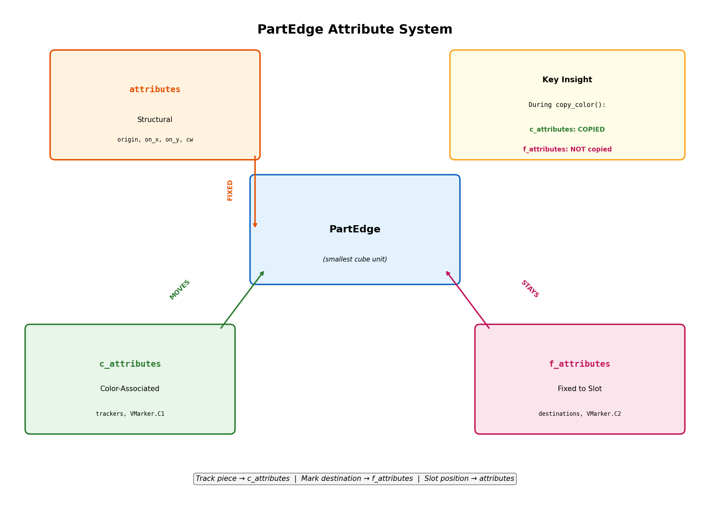
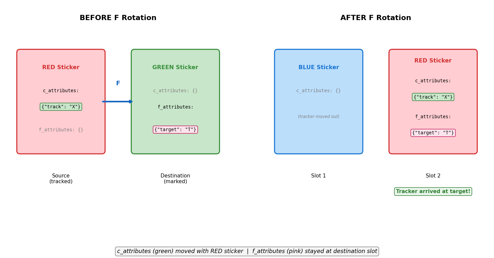

# PartEdge Attribute System

## Overview

PartEdge has **three distinct attribute dictionaries** that serve different purposes during cube rotation and animation visualization. Understanding when to use each is critical for:

- Tracking pieces during solver algorithms
- Animating piece movements in the GUI
- Marking destination positions for visual feedback

## The Three Attribute Types

| Attribute | Moves with Color? | Purpose | Set When |
|-----------|-------------------|---------|----------|
| `attributes` | No (structural) | Physical slot properties | Once at initialization |
| `c_attributes` | **YES** | Track pieces as they move | Dynamic during solving |
| `f_attributes` | **NO** (fixed) | Mark destination slots | Dynamic during animation |

## Visual Diagram



## 1. `attributes` - Structural/Positional

**Definition:** Properties of the physical slot itself, never change after initialization.

**Set in:** [`Face.finish_init()`](../src/cube/domain/model/Face.py) (lines 97-125)

**Keys used:**
- `"origin"` (bool) - Marks slice 0 on each edge as the coordinate origin
- `"on_x"` (bool) - Marks the slice extending in X direction (bottom edge)
- `"on_y"` (bool) - Marks the slice extending in Y direction (left edge)
- `"cw"` (int) - Clockwise rotation index for mapping slice positions

**Usage in code:**
```python
# Face.py:97-100 - Setting origin markers
self._edge_bottom.get_slice(0).get_face_edge(self).attributes["origin"] = True
self._edge_left.get_slice(0).get_face_edge(self).attributes["origin"] = True

# Face.py:109-112 - Setting clockwise indices
self._edge_left.get_slice(i).get_face_edge(self).attributes["cw"] = i
self._edge_right.get_slice(i).get_face_edge(self).attributes["cw"] = n1 - i
```

**Used by:** [`Edge._find_cw()`](../src/cube/domain/model/Edge.py) and `Edge.cw_s()` for rotation calculations.

## 2. `c_attributes` - Color-Associated (Moves WITH Color)

**Definition:** Attributes that travel with the colored sticker during cube rotations.

**Copied in:** [`PartEdge.copy_color()`](../src/cube/domain/model/PartEdge.py) (lines 63-67)

```python
def copy_color(self, source: "PartEdge"):
    self._color = source._color
    self._annotated_by_color = source._annotated_by_color
    self.c_attributes.clear()
    self.c_attributes.update(source.c_attributes)  # <-- COPIED!
```

**Keys used:**
- `"n"` (int) - Sequential number for each edge slice (1, 2, 3, ...)
- Tracker keys - Unique IDs for [`FaceTracker.by_center_piece()`](../src/cube/domain/solver/common/FaceTracker.py)
- `VMarker.C1` - Visual marker for "moved" annotation

**Use case - Tracking a Piece:**
```python
# FaceTracker.py:59-60 - Mark a slice to track it
edge = _slice.edge
edge.c_attributes[key] = True  # This marker follows the piece!

# Later, find where it moved to:
def _slice_pred(s: CenterSlice):
    return key in s.edge.c_attributes  # Search for our marker
```

**Key Insight:** When you want to **track a specific colored sticker** as it moves around the cube, put your marker in `c_attributes`. It will follow the color through any rotation.

## 3. `f_attributes` - Fixed (Stays at Physical Slot)

**Definition:** Attributes that stay at the physical slot position, never move with colors.

**Declaration in:** [`PartEdge.__init__()`](../src/cube/domain/model/PartEdge.py) (line 41)

```python
# defaultdict(bool) - missing keys return False
self.f_attributes: dict[Hashable, Any] = defaultdict(bool)
```

**NOT copied in `copy_color()`** - this is the key difference!

**Keys used:**
- `VMarker.C2` - Visual marker for "fixed position" annotation
- Annotation tracking keys for [`OpAnnotation`](../src/cube/application/commands/OpAnnotation.py)

**Use case - Marking a Destination:**
```python
# OpAnnotation.py:95-97 - Mark where piece should go
if fixed:
    add_marker(_slice.f_attributes, marker)
    _slice.f_attributes[key] = key  # This marker stays at destination!
```

**Key Insight:** When you want to **mark a destination** (where a piece should end up), use `f_attributes`. The marker stays there while pieces rotate around it.

## Animation Use Case

The annotation system uses both attribute types together for powerful visualization:



```
┌─────────────────────────────────────────────────────────┐
│  BEFORE ROTATION                                         │
│                                                          │
│  ┌─────────┐          ┌─────────┐                       │
│  │ RED     │          │ GREEN   │                       │
│  │ c: "X"  │  ────►   │ f: "T"  │  (Target marked)     │
│  │ (track) │          │         │                       │
│  └─────────┘          └─────────┘                       │
│                                                          │
│  AFTER F ROTATION                                        │
│                                                          │
│  ┌─────────┐          ┌─────────┐                       │
│  │ BLUE    │          │ RED     │                       │
│  │         │          │ f: "T"  │  (Target still here) │
│  │         │          │ c: "X"  │  (Tracker arrived!)  │
│  └─────────┘          └─────────┘                       │
│                                                          │
│  The tracker "X" moved with the RED sticker             │
│  The target "T" stayed at its fixed position            │
└─────────────────────────────────────────────────────────┘
```

## AnnWhat Enum Mapping

The [`AnnWhat`](../src/cube/application/commands/AnnWhat.py) enum controls which attribute type is used:

| AnnWhat Value | Attribute Used | Marker | Purpose |
|---------------|----------------|--------|---------|
| `AnnWhat.Moved` | `c_attributes` | `VMarker.C1` | Track piece as it moves |
| `AnnWhat.FixedPosition` | `f_attributes` | `VMarker.C2` | Mark destination slot |
| `AnnWhat.Both` | Both | Both | Track and show destination |

## PartSlice Also Has c_attributes

Note: [`PartSlice`](../src/cube/domain/model/_part_slice.py) also has its own `c_attributes` dictionary (line 85):

```python
# PartSlice.__init__
self.c_attributes: dict[Hashable, Any] = defaultdict(bool)
```

This is separate from `PartEdge.c_attributes` and is used at the slice level for tracking.

## Summary

| Question | Answer |
|----------|--------|
| "Where is this slot physically?" | Use `attributes` |
| "Track this sticker wherever it goes" | Use `c_attributes` |
| "Mark this destination position" | Use `f_attributes` |

## Code References

- [`PartEdge.py`](../src/cube/domain/model/PartEdge.py) - Attribute definitions (lines 37-41)
- [`Face.py`](../src/cube/domain/model/Face.py) - Attribute initialization (lines 97-125)
- [`OpAnnotation.py`](../src/cube/application/commands/OpAnnotation.py) - Animation annotation system
- [`FaceTracker.py`](../src/cube/domain/solver/common/FaceTracker.py) - Piece tracking during solving
- [`VMarker.py`](../src/cube/presentation/viewer/VMarker.py) - Visual marker enum

---

*See: design2/model-id-system.md for related ID system documentation*
