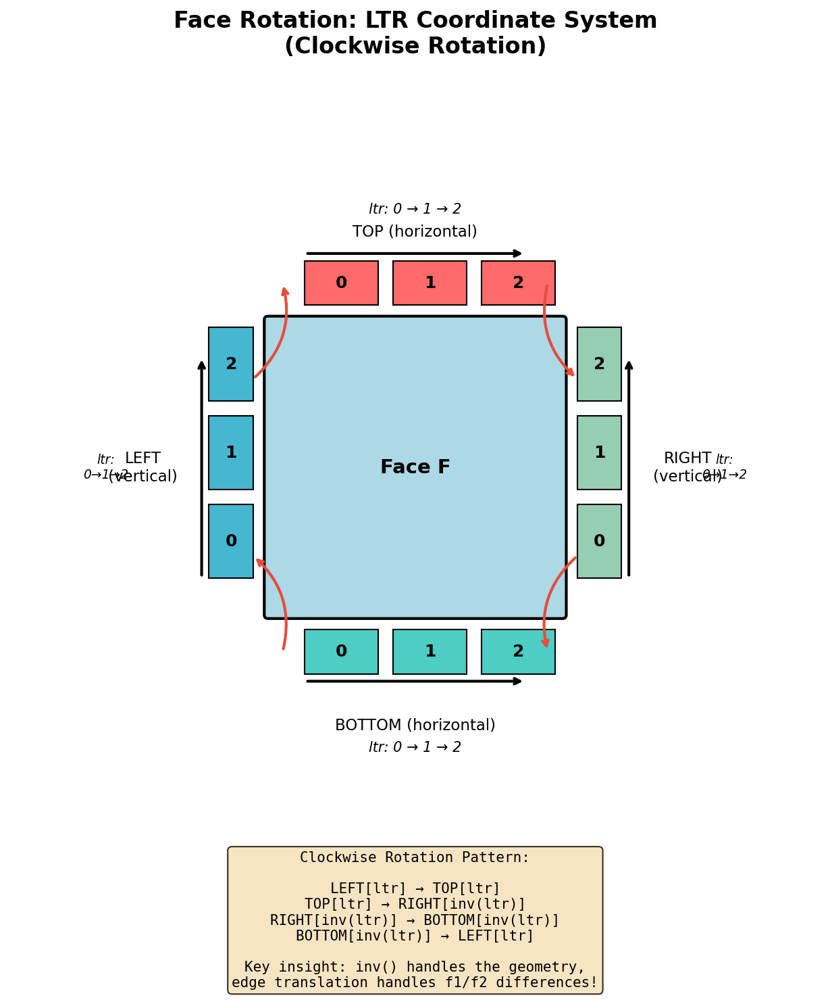
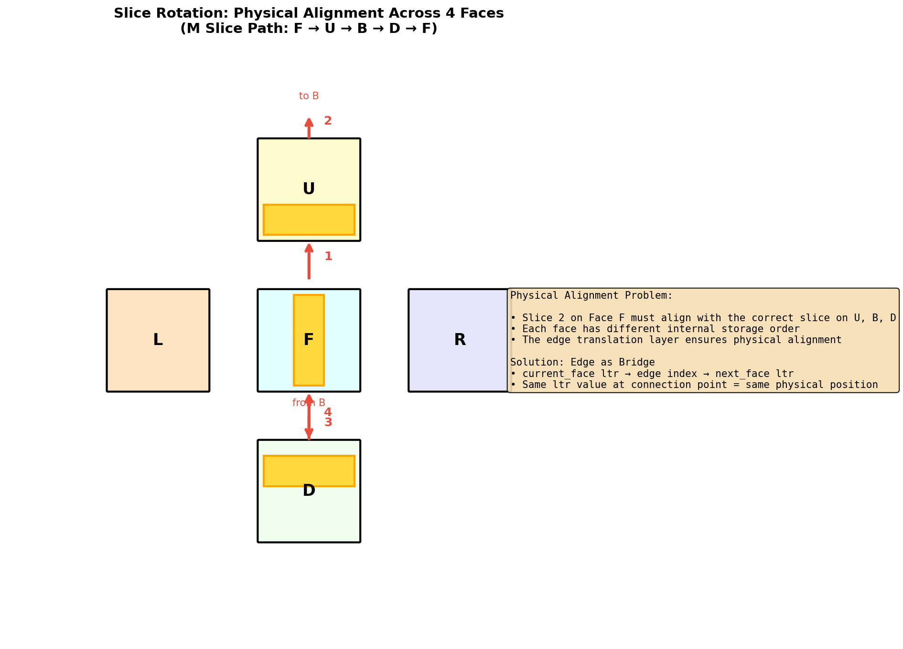

# Edge-Face Coordinate System

This document explains how coordinates work on cube faces, and how edges translate between the coordinate systems of the two faces they connect.

---

## The LTR Coordinate System

Every face has a consistent coordinate system called LTR (Left-to-Right). When you look at a face from outside the cube, the origin (0,0) sits at the bottom-left corner. The x-coordinate increases as you move right, and the y-coordinate increases as you move up.

```
    Looking at a face from outside:

         ltr_x:  0    1    2
              ┌─────────────┐
    ltr_y: 2  │             │
              │             │
    ltr_y: 1  │      F      │
              │             │
    ltr_y: 0  │             │
              └─────────────┘
              (0,0) = bottom-left
```

The face's internal index system and its LTR system are the same thing. When code refers to position (1, 2) on a face, that IS the LTR coordinate—there's no conversion needed within a face.

The translation problem arises at edges. An edge connects two faces, and each face has its own LTR system. The edge stores its slices in some internal order, but each face expects to access those slices using its own LTR coordinates. The edge's job is to translate between its internal storage and whatever face is asking.

When a face rotates clockwise, the content flows around: LEFT edge → TOP edge → RIGHT edge → BOTTOM edge → back to LEFT. The rotation pattern in LTR terms is:

```
LEFT[ltr] → TOP[ltr] → RIGHT[inv(ltr)] → BOTTOM[inv(ltr)] → LEFT[ltr]
```

The `inv()` handles the geometry of adjacent edges having opposite directions, while the edge translation handles which face is f1 vs f2.

---

## Reference Diagrams

### Hand-Drawn Diagram


*Human-drawn diagram showing the R (right) and T (top) direction arrows for each face, illustrating which edge pairs have same vs opposite indexing directions.*

### Generated Diagram (Clean Version)


*Generated diagram showing:*
- *Left: 3D cube with ✓ (green) = same_direction True, ✗ (red) = False*
- *Right: Unfolded cube with R (blue→) and T (red↑) direction arrows on each face*
- *Summary: 8 edges SAME, 4 edges OPPOSITE (L-U, U-B, D-R, D-B)*

---

## How Edges Handle Two Faces

An edge is shared by exactly two faces. Each face expects to access the edge's slices using its own LTR system, but the edge can only store its slices in one order. By convention, the edge aligns its internal storage with the first face (f1). The second face (f2) may see the slices in the same order or reversed.

The `same_direction` flag captures this relationship. When true, both faces see slices in the same order—f2 can use LTR directly. When false, f2's LTR must be inverted to get the correct slice index.

There's an important constraint: if a face appears as f1 in one edge, it should be f1 in all edges where the direction differs. Otherwise the face's coordinate system becomes inconsistent. This was the root cause of Issue #53:

```python
# Bug: U was f2 in L-U edge but f1 in U-B edge
l._edge_top = u._edge_left = _create_edge(edges, l, u, False)  # U is f2
u._edge_top = b._edge_top = _create_edge(edges, u, b, False)   # U is f1  ← inconsistent!

# Fix: U is consistently f1 in both edges
l._edge_top = u._edge_left = _create_edge(edges, u, l, False)  # U is f1
u._edge_top = b._edge_top = _create_edge(edges, u, b, False)   # U is f1
```

---

## Why This Design Works

Face consistency is guaranteed by construction. The LTR system is defined at the face level, and edges merely provide translation to and from their internal indices. Different edges of the same face may use different translations, but they all translate to the same face-level LTR system.

An earlier approach asked whether opposite edges "agree" with each other, but this question doesn't make sense. Left and right edges are different physical objects with different internal orderings. They both translate to the same face LTR system—the translations differ, but the result is the same coordinate space.

When you access an edge from a face, you're really asking "give me the slice at this LTR position." The edge translates your LTR coordinate to its internal index, fetches the slice, and returns it. If the face is f1, the translation is direct. If the face is f2 and the direction differs, the index gets inverted. Either way, the face always gets the slice at the LTR position it asked for.

---

## Translation Functions

### Edge → Face LTR

```python
def get_ltr_index_from_slice_index(self, face: Face, slice_i: int) -> int:
    """Convert edge's internal slice index to face's ltr coordinate."""
    if self.same_direction:
        return slice_i  # Both faces see same order
    else:
        if face is self._f1:
            return slice_i  # f1's ltr matches edge's internal order
        else:
            return self.inv_index(slice_i)  # f2 sees inverted order
```

### Face LTR → Edge

```python
def get_slice_index_from_ltr_index(self, face: Face, ltr_i: int) -> int:
    """Convert face's ltr coordinate to edge's internal slice index."""
    if self.same_direction:
        return ltr_i  # Both faces see same order
    else:
        if face is self._f1:
            return ltr_i  # f1's ltr matches edge's internal order
        else:
            return self.inv_index(ltr_i)  # f2 sees inverted order
```

---

## Face Rotation



The face rotation code works entirely in the face's own LTR system. The `inv()` function handles the rotation geometry (adjacent edges have opposite LTR directions), while `get_slice_index_from_ltr_index()` handles f1/f2 translation automatically. The face never needs to know whether it's f1 or f2 in any of its edges.

```python
for index in range(n_slices):
    top_ltr_index = saved_top.get_face_ltr_index_from_edge_slice_index(self, index)

    i_left = e_left.get_edge_slice_index_from_face_ltr_index(self, top_ltr_index)
    i_right = e_right.get_edge_slice_index_from_face_ltr_index(self, inv(top_ltr_index))
    i_bottom = e_bottom.get_edge_slice_index_from_face_ltr_index(self, inv(top_ltr_index))
```

---

## Slice Rotation



Slice rotation moves colors around four faces. The challenge is physical alignment: when a user rotates slice 2 on face F, they expect it to connect to the corresponding slice on U, B, and D—forming a continuous visual line around the cube. But each face stores slices in its own internal order. Face F's index 2 might be Face U's index 0.

The edge solves this by acting as a bridge. When moving from one face to the next, the code converts the current face's LTR to the edge's internal index, then converts that index to the next face's LTR:

```python
# Moving from current_face to next_face through shared edge
next_slice_index = next_edge.get_edge_slice_index_from_face_ltr_index(current_face, current_index)
current_index = next_edge.get_face_ltr_index_from_edge_slice_index(next_face, next_slice_index)
```

The LTR system is designed so that the same LTR value on a shared edge means the same physical slice. The translation layer handles the different internal storage orders, preserving physical alignment across all four faces.

### The Axis Exchange Problem


The complexity goes deeper: not only does the index change, but the coordinate axis itself can change as a slice moves between faces.

The M slice uses only horizontal edges, so it stays as a column on all four faces. But the S slice alternates between vertical and horizontal edges, switching between selecting rows and selecting columns as it moves around the cube.

Consider the S slice moving from U to R. On face U, the slice uses edge_left (a vertical edge), so LTR selects which row. On face R, it uses edge_top (a horizontal edge), so LTR selects which column. The slice that was a row on U becomes a column on R.

Physical alignment is still preserved because the LTR value carries through the edge translation. On U's vertical edge, ltr=1 means row 1 (from bottom). On R's horizontal edge, ltr=1 means column 1 (from left). The translation layer handles the index conversion through the shared edge, even as the meaning changes from row-selection to column-selection.

The code in `Slice.py` checks whether each edge is horizontal (top/bottom) or vertical (left/right) and interprets the LTR value accordingly.

---

## What Determines same_direction?

The `same_direction` flag is determined by geometry. Each face has R (right) and T (top) directions. An edge is either horizontal (along R) or vertical (along T) for each face. If both faces' relevant directions point the same way along the shared edge, the flag is true. If they point opposite ways, it's false. This is a fixed geometric property of the cube—not a design choice.

---

## The 12 Edges

```
SAME DIRECTION (True) - 8 edges:
  F-U, F-L, F-R, F-D    (all Front edges)
  L-D, L-B, R-B, U-R

OPPOSITE DIRECTION (False) - 4 edges:
  L-U, U-B, D-R, D-B
```

### Full Code from Cube.py

```python
# SAME DIRECTION (True) - indices match directly
f._edge_top = u._edge_bottom = _create_edge(edges, f, u, True)    # F-U
f._edge_left = l._edge_right = _create_edge(edges, f, l, True)    # F-L
f._edge_right = r._edge_left = _create_edge(edges, f, r, True)    # F-R
f._edge_bottom = d._edge_top = _create_edge(edges, f, d, True)    # F-D
l._edge_bottom = d._edge_left = _create_edge(edges, l, d, True)   # L-D
r._edge_right = b._edge_left = _create_edge(edges, r, b, True)    # R-B
l._edge_left = b._edge_right = _create_edge(edges, l, b, True)    # L-B
u._edge_right = r._edge_top = _create_edge(edges, u, r, True)     # U-R

# OPPOSITE DIRECTION (False) - indices are inverted
l._edge_top = u._edge_left = _create_edge(edges, l, u, False)     # L-U
d._edge_right = r._edge_bottom = _create_edge(edges, d, r, False) # D-R
d._edge_bottom = b._edge_bottom = _create_edge(edges, d, b, False) # D-B
u._edge_top = b._edge_top = _create_edge(edges, u, b, False)      # U-B
```

### Visual Summary

```
Pattern: All Front edges are SAME.
         Back edges with U or D are OPPOSITE.
         L-U and D-R are OPPOSITE.
```

---

## Code References

The translation functions live in `Edge.py`. Face rotation uses them in `Face.py`. Slice rotation uses them in `Slice.py` (around lines 98-122).

When reading code that uses LTR translation, refer back to this document to understand why the translation exists and how it preserves physical alignment across faces.
