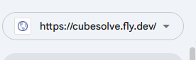

# Search Engine Setup for CubeSolve

After deploying, follow these steps to make `cubesolve.fly.dev` discoverable by Google and Bing.

---

_## Google Search Console

1. Go to **https://search.google.com/search-console**
2. Click **"Add Property"** → choose **"URL prefix"** → enter `https://cubesolve.fly.dev`
3. **Verify ownership** — Google offers several methods. Use **"HTML file"** (recommended):

### Option A: HTML File Verification (recommended)

   1. Google gives you a file to download (e.g. `googlec6abcc18119706a3.html`)
   2. Copy it into `static/public/`:
      ```bash
      cp ~/Downloads/googlec6abcc18119706a3.html static/public/
      ```
   3. Rebuild: `npx vite build` (this copies it to `dist/`)
   4. Deploy (so it's accessible at `https://cubesolve.fly.dev/googlec6abcc18119706a3.html`)
   5. Click **VERIFY** in Google Search Console
   6. **Keep the file permanently** — don't remove it even after verification succeeds

### Option B: HTML Meta Tag

   - Google gives you a `<meta name="google-site-verification" content="...">` tag
   - Add it to `static/index.html` inside `<head>`
   - Rebuild with `npx vite build` and redeploy

google console: https://search.google.com/search-console
https://search.google.com/search-console/sitemaps 

### After Verification

4. Go to **"Sitemaps"** in the left menu_
5. Enter `sitemap.xml` → click **Submit**

## Bing Webmaster Tools

1. Go to **https://www.bing.com/webmasters**
2. Sign in → **"Add Site"** → enter `https://cubesolve.fly.dev`
3. Verify — easiest option: **"Import from Google Search Console"**
   - Or use HTML meta tag method (similar to Google)
4. Sitemap is auto-discovered from `robots.txt`, but you can also submit manually

---

## Verify Everything Works

After deploy, check these URLs:

| URL | What it does |
|-----|--------------|
| `https://cubesolve.fly.dev/robots.txt` | Tells crawlers what to index |
| `https://cubesolve.fly.dev/sitemap.xml` | Lists all URLs for crawlers |
| `https://cubesolve.fly.dev/og-image.png` | Social sharing preview image |
| `https://cubesolve.fly.dev/favicon.png` | Browser tab icon |

## Test Social Sharing Previews

- **Facebook/WhatsApp:** https://developers.facebook.com/tools/debug/ — paste your URL
- **Twitter:** https://cards-dev.twitter.com/validator — paste your URL
- **LinkedIn:** https://www.linkedin.com/post-inspector/ — paste your URL
- **Google Rich Results:** https://search.google.com/test/rich-results — paste your URL

---

## What Was Added (SEO Files)

All source files are in `static/` and get built to `static/dist/` via `npx vite build`.

| File | Purpose |
|------|---------|
| `static/index.html` | Meta description, OG tags, Twitter cards, JSON-LD structured data, favicon, tagline, noscript |
| `static/styles.css` | Tagline styling |
| `static/public/robots.txt` | Crawler permissions + sitemap location |
| `static/public/sitemap.xml` | URL listing for search engines |
| `static/public/og-image.png` | 1200x630 image shown in social previews |
| `static/public/favicon.png` | 64x64 cube icon for browser tab |

> Files in `static/public/` are copied as-is to `dist/` by Vite (no hashing, no bundling) because they need fixed URLs.
