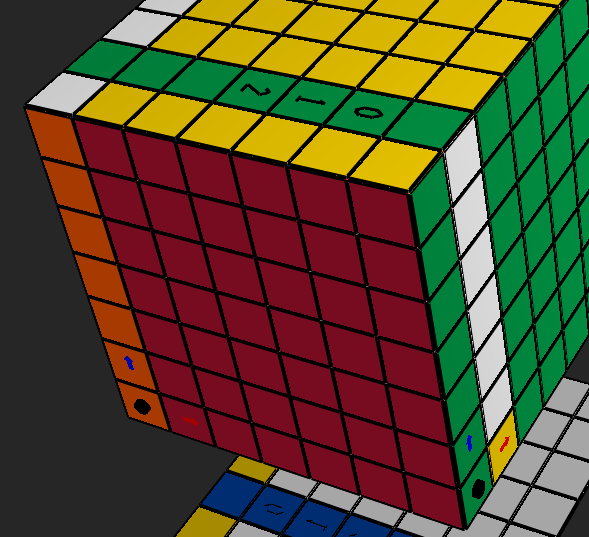

# Why we need this
```python
        if True:
            if slice_name is SliceName.M:
                if current_face is cube.back:
                    current_index = inv(current_index)
            elif slice_name is SliceName.S:
                if current_face in [cube.down, cube.left]:
                    current_index = inv(current_index)
```

```python

# Pick first two consecutive faces
        fidx = -1
        if True:  # investigating the bug
            for i, f in enumerate(cycle_faces_ordered):
                if f is cube.back:
                    fidx = i
                    break

```

see image:


the index is close to the LTR origin