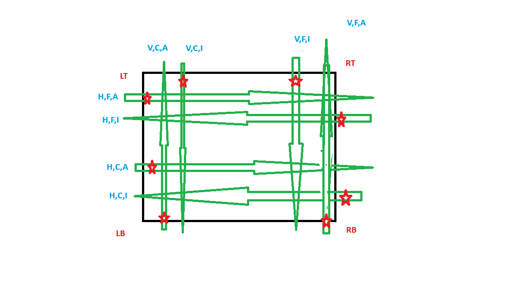

I want to rewrite the logic ofmethod create_walking_info_unit which is oe of the most method cube geomteric.
The current implementation is bug free but is most non clear to human

I want to define it is other terms, i want ypu to ehlp dcoumnet the method in much clear way, and maybe help to implement it

in _SliceLayout
def _get_slice_on_face_coordinate_system():

    The puprose of this metod is create the clucaltors that know to calc
the path of slice of given face
    as descirbed in slice_layout the reqimnet is that slice is cotinues when
    moving from face to face, this si what determind the coordinates of 
         slice_to_center(slice_index, slot number)

   input:
        slice name - give from slice lyout object
        face name maybe
         entry_edge, the from it the slice enter the face
         rotate_edge - the slice that is on the slice rataing face and is shared with the current face
   
   I think that there three caracsitcs of the inputs:
    
   the slice is horizonal(H) or vertical(V) - the rotating  edge is left/right or button/top
   the slice index 0 is close(C) to X/Y axis the rotating edge of (F) from it
   the  the slice direction from entry edge to oposite edge is aligend  direction of X/Y (A) axis (from button to top, left to right) or it is the opposite(I)
    
   Given this we have 8 cases

   output:

        slice_to_center(slice_index, slot number) - given a point on slice copute corrdiant eon face center system
        slice_to_entery_edge(slice_index) given slice index compute piece index of entry edge
        center_to_slice(row, col) -> given coordinate of center coordnaite system compute slice index and slot number

   

   
 