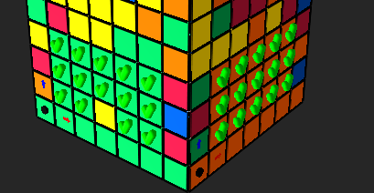

#✅✅✅ 7x7 Cube slice #2 corrupt first slice
1. reset
2. Scramble 0
3. in _LBLSlcies
```python
        if True:  # WIP: Only solve first slice for now
            to = 3
            r = range(min(to, self.n_slices))

```
when solving firstslice it is ok
when solving second slice also ok
when solving slice 3 (index 2) it corrupts slice 1(index 0)


# Not all upper slices ae solved, sometime repeating solve solves
### but in 9x9 we get maximum iteration error

1. 9x9
2. reset
2. 0
3. Solve --> 
4.   File "F:\Dev\code\python\cubesolve2\src\cube\domain\solver\direct\lbl\NxNCenters2.py", line 165, in _solve_single_center_slice_all_sources
    raise InternalSWError("Maximum number of iterations reached")

# Upper slices ar enot solved

1. Size 5x5 
2. Scramble 0
2. Solve no animation

 

##  steps:
1. Reset
2. 0
3. Solve Slice 4
4. Y2

All silces ok, but the blue, this is the current bug we work on
