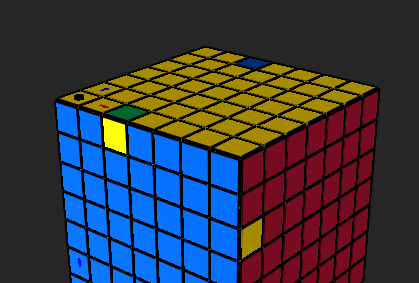
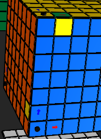
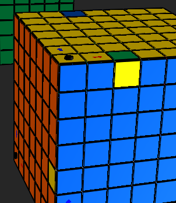

## References

- https://www.youtube.com/watch?v=lv9y8_4UZrk

# Suammry
## Up to right

### U R U' [2]M' U R' U' [2]M
This bring up to Right

## Up to left
### U' L' U [1]M' U' L U [1]M
Bring up to left

- 
- 
# Story 
  3:12

# U R U' L' U R' U' L
# try replace L with [2]M
U R U' [2]M' U R' U' [2]M
This bring up to Right

11:50 he start more examples:

# But how up to left ?
14:36, he says
U' L' ...
# maybe h means 3 corenrs 
Alternative (Clockwise Cycle): 
L' U R U' L U R' U' ? so I tried

# isten again  - works
U' L' U [2]M' U' L U [2]M

# explanation
#explain - this the left hand algorithm that leave left corner
# M rotate with L against R so when he R, he means [2]M' !!!
#U' L' U R U' L U R'

- 
- [PuzzleMax13 YouTube Channel](https://www.youtube.com/@puzzlemax13)

- [SpeedSolving: Layer-by-Layer Discussion](https://www.speedsolving.com/threads/solving-the-4x4x4-cube-layer-by-layer.18490/)
- [Ruwix: Big Cube Solutions](https://ruwix.com/twisty-puzzles/big-cubes-nxnxn-solution/)
- [Kenneth's Big Cube Method](https://www.speedsolving.com/threads/kenneths-big-cube-method-explained.4073/)

